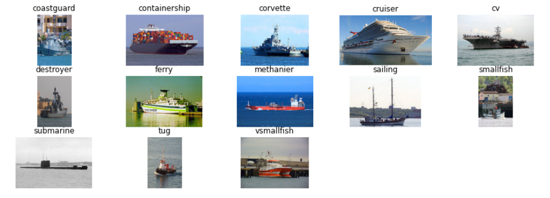
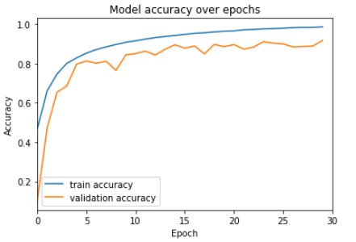
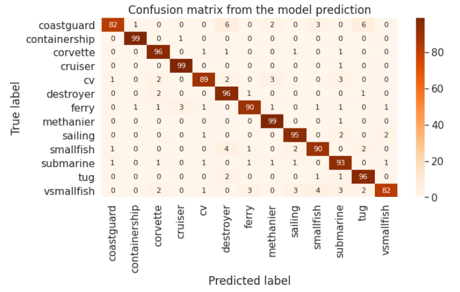

# Convolutional Neural Network for ship classification

Handmade convolutional network for ship classification. All the explanations and details of the dataset and the convolutional neural network can be found in the jupyter notebook ``main.ipynb``.

The goal is to predict the type of a ship along 13 different categories of ships.

## Table of content
* Check data
* Setup data
* Data augmentation
* Model creation
* Model training
* Model accuracy
* Submission
* More images

## Dataset

The dataset can be found on kaggle <a href="https://www.kaggle.com/c/shipsmano2021">here</a>.

Here are some images from the dataset used to train the convolutional neural network.



## Convolutional Neural Network

Number of layers:  29
Model: "sequential_1"

| Layer (type) | Output Shape | Param #  |
| ------------- |:-------------:| -----:|
| conv2d (Conv2D) | (None, 128, 128, 64) | 1792 |
|batch_normalization (BatchNormalization)       |    (None, 128, 128, 64)          |               256 |
|conv2d_1 (Conv2D)                              |    (None, 128, 128, 64)           |              36928|
|batch_normalization_1 (BatchNormalization)     |    (None, 128, 128, 64)          |               256|
|max_pooling2d (MaxPooling2D)                   |    (None, 64, 64, 64)            |               0|
|dropout (Dropout)                              |    (None, 64, 64, 64)            |               0|
|conv2d_2 (Conv2D)                              |    (None, 64, 64, 128)                 |         73856|
|batch_normalization_2 (BatchNormalization)     |   (None, 64, 64, 128)             |             512|
|conv2d_3 (Conv2D)                              |     (None, 64, 64, 128)             |             147584| 
|batch_normalization_3 (BatchNormalization)     |     (None, 64, 64, 128)             |             512     |
|max_pooling2d_1 (MaxPooling2D)                 |      (None, 32, 32, 128)              |            0|
|dropout_1 (Dropout)                            |    (None, 32, 32, 128)             |             0|
|conv2d_4 (Conv2D)                              |    (None, 32, 32, 256)                |         295168|
|batch_normalization_4 (BatchNormalization)       |  (None, 32, 32, 256)            |              1024|
|conv2d_5 (Conv2D)                       |           (None, 32, 32, 256)                |          590080|
|batch_normalization_5 (BatchNormalization)     |   (None, 32, 32, 256)       |                   1024|
|max_pooling2d_2 (MaxPooling2D)               |      (None, 16, 16, 256)            |              0|
|dropout_2 (Dropout)                     |           (None, 16, 16, 256)            |              0|
|conv2d_6 (Conv2D)                 |                 (None, 16, 16, 512)             |             1180160|
|batch_normalization_6 (BatchNormalization)      |   (None, 16, 16, 512)               |           2048|
|conv2d_7 (Conv2D)                |                  (None, 16, 16, 512)                |          2359808|
|batch_normalization_7 (BatchNormalization)  |       (None, 16, 16, 512)            |              2048|
|max_pooling2d_3 (MaxPooling2D)          |           (None, 8, 8, 512)           |                 0|
|dropout_3 (Dropout)               |                 (None, 8, 8, 512)      |                      0|
|global_average_pooling2d (GlobalAveragePooling2D) | (None, 512)                  |                0|
|dropout_4 (Dropout)             |                   (None, 512)          |                        0|
|dense (Dense)                   |                   (None, 512)                |                  |262656|
|dense_1 (Dense)                 |                   (None, 128)            |                      65664|
|dense_2 (Dense)                   |                 (None, 13)              |                     1677|


* Total params: 5,023,053
* Trainable params: 5,019,213
* Non-trainable params: 3,840


## Training

The training is ran over 30 epochs (with checkpoints and early stopping if needed).

Here is the verbose of the last epoch:
```
Epoch 30/30
325/325 [==============================] - 104s 320ms/step
loss: 0.0427 - accuracy: 0.9866 - val_loss: 0.3337 - val_accuracy: 0.9171
```

Here is the curve of the model accuracy (with training accuracy and validation accuracy):



## Result

The model accuracy over the test data is **92.77%**.

And the confusion matrix is the following:


